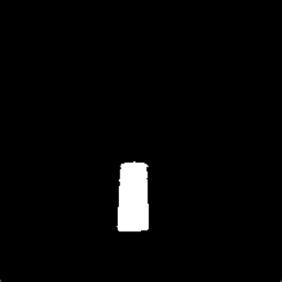
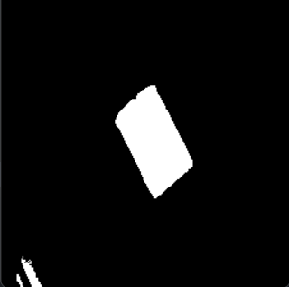
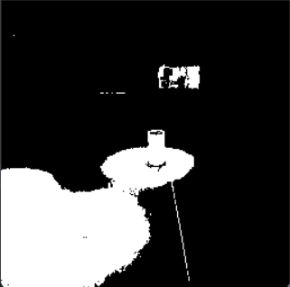
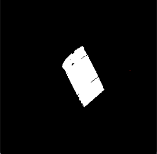
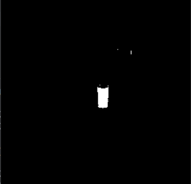
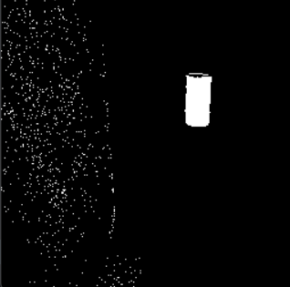
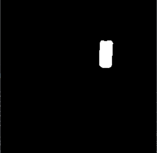

# Barrels Segmentation

This repo was created to complete the coding challenge for the 2D Object Detection team at **aUtoronto**.

## How to run

You will, at the least, need an `images/` folder in the root directory (next to the `main.py`) with *.png* input files.

```
images/
main.py
```

Once that is done, simply execute `main.py` in the root directory. After the script is complete, the binary segmentation mask can be found in `output/`.

```
python main.py
```
---

## How did I come up with this?

To start off this challenge, I first looked at the dataset and tried to get an undestanding of the task at hand. I noticed the different lighting conditions and several other objects/text that shared characteristics with the Barrels. I decided that a classical approach would suffice as compared to a deep learning approach, which would require training on a larger dataset.

The main classical approach I wanted to pursue was thresholding. Although, I knew the challenging part would be deriving the thresholding values depending on the lighting in the image. I tried to process the input into images with the most distinction between the Barrel and background before performing thresholding, so that it would be more reliable.

I created a notebook on a Google Colab [notebook] and ported over the dataset to my GDrive so that I could tinker with color channels. In the past, I had worked with YCbCr and RGB channels. I thought that it would be helpful to take a closer look at the dataset images under the eyes of different color channels and spaces. While seperating the images into their respective channels, I was looking for channels that highlighted the difference between the Barrel and the background.

My initial experiments with the YCbCr channels were as follows:


The Cr channel shows a clear distinction between the Barrel and the background. However, its not perfect as the red floor is also detected. Threhsolding could solve this issue, but it may not work for every scenario.

At the same time, the Y channel also distinguishes the Barrel, although inverted. Additionally, the floor is considerably brighter than the Barrel in the Y channel. I considered combining the Cr and Y channels as subtracting the floor pixels in the Y channel from the floor pixels in the Cr channel could make the distinction between the floor and Barrel even clearer.

My thought process behind the pixels: (bright) - (relatively bright) = (darker) AND (slighlty dark) - (dark) = (negative) AND (really bright) - (really dark) = (really bright)

```
cry = cr - y
cry = np.clip(cry, 0, 255)
```

The resulting image:


In this image, we can see a much more clear distinction between the Barrel and the foreground and after performing thresholding, it looks like:


Following this, I used the idea of combining channels and then performing thresholding to mask Barrels in the provided images.

I tried this method with several other images from the dataset (with different lighting conditions, pylons in the background, and, coca-cola). Additionally, I researched other color spaces that would help highlight red in images and I came across HSV. Images in the S channel had the clearest distinction between the Barrel and background and looked like: 


The initial mask is generated by combining the Cr, S, and Y in the following manner:

```
mask_a = cr - s - y
```

Threhsolding with `min=0` and `max=20` then gives a binary segmentation mask. Although these technique works great for some pictures, it does not work for others. Additionally, there is a lot of pixel noise in a mask generated through this method.

**(a1)**  


**(a2)**  


**(a3)**  


To solve this issue, I looked at other color spaces.

### Combining masks (Two are better than one)

In the RGB space, the red channel is high when the pixel is either red or white. When the pixel is white, the green and blue channels are also higher values. Therefore, I filtered all the pixels where the difference between the red and blue/green was greater than a threshold (i.e. a purely red pixel).

```
bg = np.mean(np.array([b, g]), axis=0)
mask_b = (r - bg) > thresh
```

The threhsold value is derived from the brightness of the red patches in the images (`brightness_mask`). A larger `brightness_mask` value suggests that the image has bright patches of red, and thus the threshold should be larger. A smaller value suggests low light conditions and therefore a lower threshold.

Similar images put through this technique result in:


**(b1)**  


**(b2)**  


**(b3)**  


Comparing *a1-a3* and *b1-b3* (where *a* represents `mask_a` and *b* represents `mask_b`), some masks are good whereas some are noisy. However, when combining these masks, the results are generally more positive.

**(c1)**  


**(c2)**  


**(c3)**  


Most of the combined masks produce reliable segmentations, although some are still noisy. To address this, post processing is applied through the `post_processing` function.

**Before**  


**After**  


---

## Next Steps

The method I used is not perfect. Some of the clear issues are that objects that are similar in color are also segmented (pylons, coca-cola, exit sign, etc). To improve on this, I would use a deep learning model such as UNet that is widely known to be used for segmentation tasks. The model should be able to learn the core characteristics of a barrel (the shape, the lighting, the context). Through this, it is possible to filter false positives such as red text, red pylons, and red floors from the masks. However, this would require a large and diverse training dataset. The issue of noise may still persist with deep learning methods so it would be important to balance computational resources between the pre-processing, inference, and post-processing steps. One option is to use a GPU to perform computations. An optimization would be to reduce the number of input channels and dimensions for the model input, and then scale the segmentation mask up to the required dimensions. This will result in a softer image, but if the task is to place a Barrel in a roughly estimated location, a patch of white pixels may suffice.

Other classical techniques (I definitely don't know about all of them and may have missed a viable one) to detect a Barrel shape would not work too well (for example, I thought of using contours). This is because the barrel is often in different orientations and may be blocked by several objects, making it difficult to find an ideal Barrel-like shape. However, a neural network may be able to find other patterns (other than color) in the data to identify what a Barrel may be.

There is another idea which may be too computationally demanding but may produce solid results. It is possible to have a YOLOv4 model detect the location of a Barrel and then run that section of the image through a UNet model. This would drastically reduce noise but would obviously require training two separate models. This method has been used in realtime hand segmentation before and there are research papers discussing the methodologies (which may be applied here).

In my current implementaion, to find the best threshold, I used `label.py` to make incremental changes to the threshold and observe changes in `mask_a` and `mask_b`. As an extension to this, it can also be used as a rudimentary data labelling tool. Data labelling is one of the most tedious and repetitive tasks in deep learning and I hope that `label.py` makes the process quicker (at least for barrel segmentation).

### How to use `label.py`

```
python label.py
```

1. You can view `mask_a`, `mask_b`, and the combined mask, named `mask`
2. To adjust the threhsold values for `mask_a`, use the *w* key to increase and the *s* key to decrease
3. To adjust the threhsold values for `mask_b`, use the *d* key to increase and the *a* key to decrease
4. Use a *double left-click* to start an area selection and a *double left-click* to complete it.
5. Use the *r* key to reset a selection.
6. To save `mask` to the output directory, press *e*
7. To move to the next image, press the *spacebar*

---

[notebook]: https://colab.research.google.com/drive/14jy8meWag9ZsD0b9kWUVZ2cWGtd4aXAL?usp=sharing