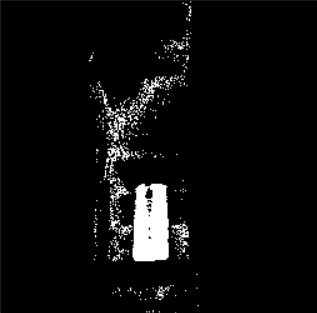
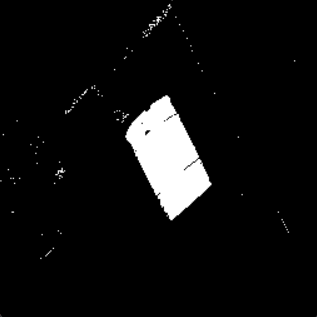

# Barrels Segmentation

This repo was created to complete the coding challenge for the 2D Object Detection team at **aUtoronto**.

## How to run

You will, at the least, need an `images/` folder in the root directory (next to the `main.py`) with *.png* input files.

```
images/
main.py
```

Once that is done, simply execute `main.py` in the root directory. After the script is complete, the binary segmentation mask can be found in `output/`.

```
python main.py
```
---

## How did I come up with this?

To start off this challenge, I first looked at the dataset and tried to get an undestanding of the task at hand. I noticed the different lighting conditions, and several other objects/text that shared characteristics with the Barrels. I decided that a classical approach would suffice as compared to a deep learning approach, which would require training on a larger dataset.

The main classical approach I wanted to pursue was thresholding. Although, I knew the challenging part would be deriving the thresholding values depending on the lighting in the image.

I first created a notebook on Google Colab (`Barrels.ipnb`) **and** ported over the dataset to my GDrive so that I could tinker with color channels. In the past, I had worked with YCbCr and RGB channels. I thought that it would be helpful to take a closer look at the dataset images under the eyes of different color channels and spaces. While seperating the images into their respective channels, I was looking for channels that highlighted the difference between the Barrel and the background.

My initial experiments with the YCbCr channels were as follows:


The Cr channel shows a clear distinction between the Barrel and the background. However, its not perfect as the red floor is also detected. Threhsolding could solve this issue, but it may not work for every scenario.

At the same time, the Y channel also distinguishes the Barrel, although inverted. Additionally, the floor is considerably brighter than the Barrel in the Y channel. I considered combining the Cr and Y channels as subtracting the floor pixels in the Y channel from the floor pixels in the Cr channel could make the distinction between the floor and Barrel even clearer.

My thought process behind the pixels: (bright) - (relatively bright) = (darker) AND (slighlty dark) - (dark) = (negative) AND (really bright) - (really dark) = (really bright)

```
cry = cr - y
cry = np.clip(cry, 0, 255)
```

The resulting image:


In this image, we can see a much more clear distinction between the Barrel and the foreground and after performing thresholding, it looks like:


These results drove my approach for the rest of this coding challenge. I used the idea of combining channels and then performing thresholding to mask Barrels in the provided images.

I tried this method with several other images from the dataset (with different lighting conditions, pylons in the background, and of course, coca cola 💀). Additionally, I researched other color spaces that would help highlight red in images and I came across HSV. Images in the S channel had the clearest distinction between the Barrel and background and looked like: 


The initial mask is generated by combining the Cr, S, and Y in the following manner:

```
mask = cr - s - y
```

Threhsolding with `min=0` and `max=20` then gives a binary segmentation mask. Although these technique works great for some pictures, it does not work for others. Additionally, there is a lot of pixel noise in a mask generated through this method.

**Good**  


**Ehh (Too much noise)**  


**Terrible**  


When I hit this roadblock, I turned again towards combining color channels. Specifically, I looked at RGB .

### Combining masks (Two are better than one)


